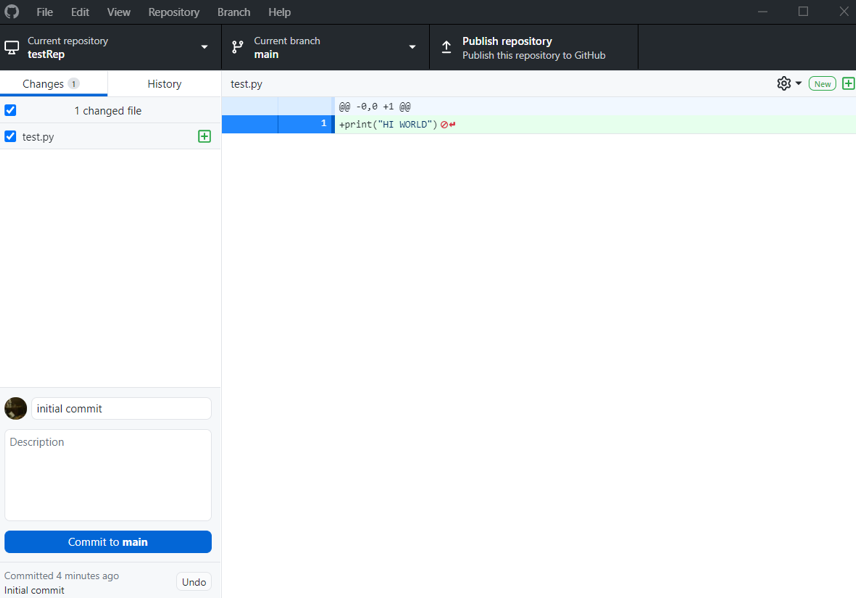
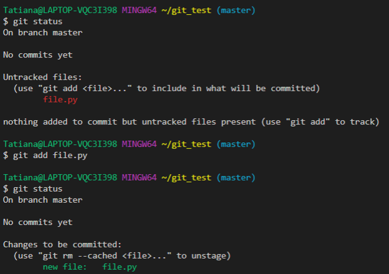

### 1.Основы работы с Git в графическом режиме.   
- Установить на компьютер графический клиент Git. (Установлен GitHub Desktop)

- Создайте в своей домашней папке (или в любой другой на ваш выбор) каталог, который будет содержать файлы нового программного проекта. Инициализируйте в этой директории репозиторий гит.
 
- Обратите внимание на появление в этой папке скрытой подпапки с названием .git. 

- Создайте новый файл для исходного текста программы. Если вы используете программный фреймворк, инициализируйте его в рабочий каталог. Напишите несколько строк вашей программы.

- Совершите ваш первый коммит. Напишите осмысленное сообщение коммита.

- Повторите несколько раз. Каждый раз, завершая определенный этап работы, выполняйте коммит и описывайте проделанные изменения в сообщении коммита.

 
- Просмотрите историю коммитов. Попробуйте перейти на один из прошлых коммитов. Вернитесь в актуальное состояние программы.

- Также пробовала работать и коммитить в другом графическом клиенте Gitа в GitGui (на светлом фоне) и непосредственно в VSCode (на темном фоне):

 
- История коммитов:

- Посмотреть один из прошлых коммитов: 

### 2. Работа с Git в терминале:   
- Создайте рабочую директорию. Инициализируйте в рабочей директории репозиторий при помощи команды git init. Выполните в репозитории команду git status. Создайте файл для исходного текста программы. Выполните команду git status. Добавьте созданный файл под версионный контроль при помощи команды git add. Еще раз выполните git status.

- Сделайте начальный коммит при помощи команды git commit с опцией -m. Сделайте еще несколько коммитов. Выполните команду git log для просмотра истории коммитов.
	 
- Сделайте так, чтобы при коммите измененные файлы автоматически добавлялись в коммит.

- Инициализируйте в рабочей директории виртуальное окружение. Добавьте созданную служебную папку в файл .gitignore. 
 
- Создайте новую тематическую ветку git branch. Перейдите в нее с помощью git checkout. Выведите на экран список всех веток. Слейте изменения в основную ветку с помощью git merge. 

### 3. Работа с удаленными репозиториями и GitHub
- Зарегистрироваться на сайте github.com
https://github.com/TatianaVolkovaa
- Форкнуть данный репозиторий в свой аккаунт. 
https://github.com/TatianaVolkovaa/0_git_basics
 

- Склонировать созданный удаленный репозиторий в директорию ~/git/test
 

- На локальной машине пишем скрипт ~/git/test/backup.sh, с произвольным содержанием
 

- Фиксируем скрипт в репозитории (делаем коммит). Через текстовый редактор добавить любую новую строку с комментарием. Сделать коммит. Внести синтаксическую ошибку в скрипт. Сделать коммит ошибочного скрипта. Откатываем до последней рабочей версии. 
 

- Просмотреть историю коммитов
 

- Откатилось к предыдущему состоянию:
 

