# Простейшие TCP-клиент и эхо-сервер
## Основные задания: 
1.	Создать простой TCP-сервер, который принимает от клиента строку (порциями по 1 КБ) и возвращает ее. (Эхо-сервер).
2.	Сервер должен выводить в консоль служебные сообщения (с пояснениями) при наступлении любых событий:
-	Запуск сервера;
-	Начало прослушивания порта;
-	Подключение клиента;
-	Прием данных от клиента;
-	Отправка данных клиенту;
-	Отключение клиента;
-	Остановка сервера.
(file myserver.py)
 
 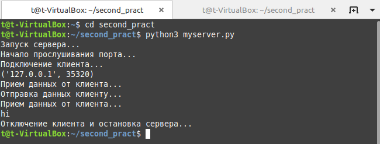

3.	Напишите простой TCP-клиент, который устанавливает соединение с сервером, считывает строку со стандартного ввода и посылает его серверу.
4.	Клиент должен выводить в консоль служебные сообщения (с пояснениями) при наступлении любых событий:
-	Соединение с сервером;
-	Разрыв соединения с сервером;
-	Отправка данных серверу;
-	Прием данных от сервера.
(file myclient.py)
 
 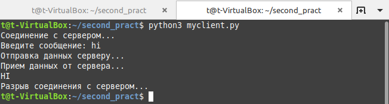

## Дополнительные задания:
####	Проверьте возможность подключения к серверу с локальной машины.
 
 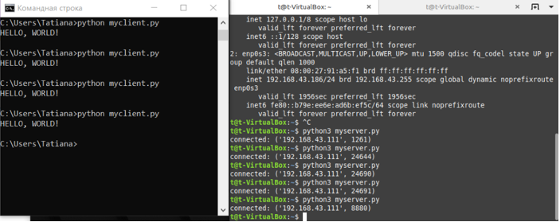

####	Модифицируйте код клиента таким образом, чтобы … (file server.py, client.py)
-	он читал строки в цикле до тех пор, пока клиент не введет “exit” (команда разрыва соединения со стороны клиента)
-	при разрыве соединения клиентом он продолжал слушать данный порт и, таким образом, был доступен для повторного подключения
-	номер порта и имя хоста (для клиента) они спрашивали у пользователя (реализовать безопасный ввод данных и значения по умолчанию)
-	все служебные сообщения выводились не в консоль, а в специальный лог-файл
-	он автоматически изменял номер порта, если он уже занят, сервер должен выводить в консоль номер порта, который он слушает
-	реализовать сервер идентификации. сервер должен принимать соединения от клиента и проверять, известен ли ему уже этот клиент (по IP-адресу). если известен, то поприветствовать его по имени. если неизвестен, то запросить у пользователя имя и записать его в файл. файл хранить в произвольном формате.
-	реализовать сервер аутентификации. похоже на предыдущее задание, но вместе с именем пользователя сервер отслеживает и проверяет пароли.)
 
 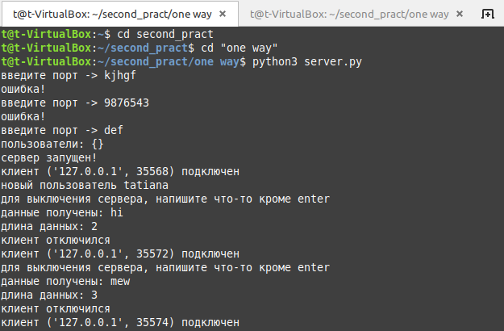
 
 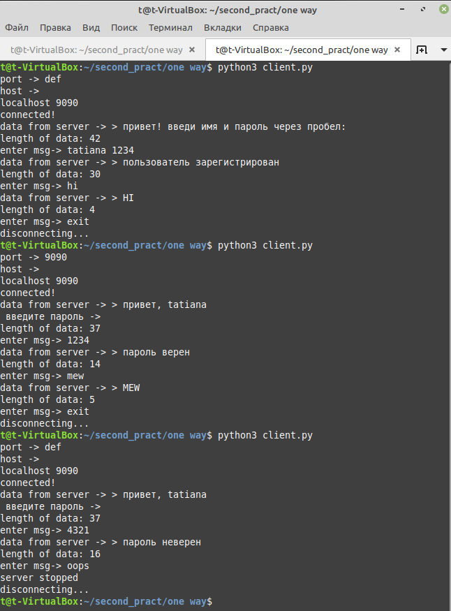
 
 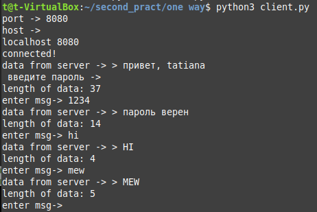
 
 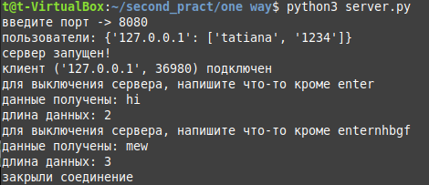
 
####	Напишите многопользовательский чат. (file chat.py)
 
 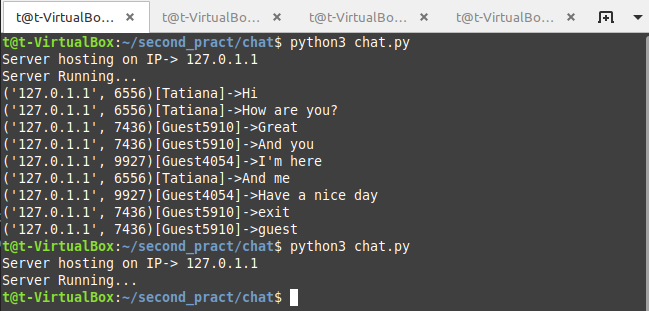	  
 
 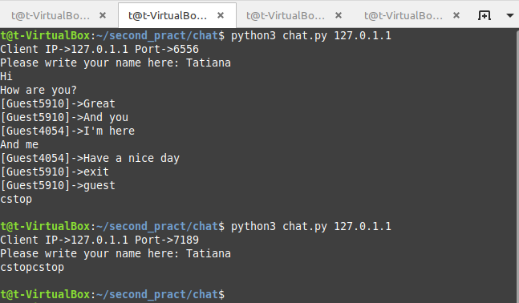	  
 
 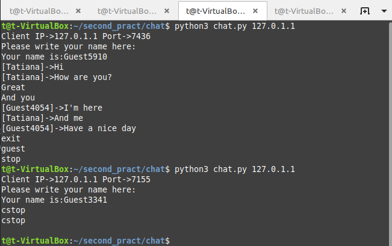	  
 
 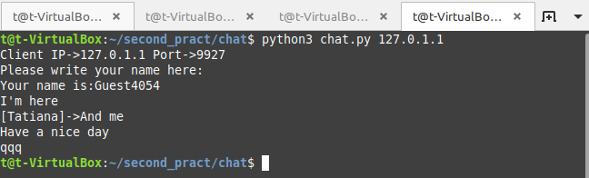	  
