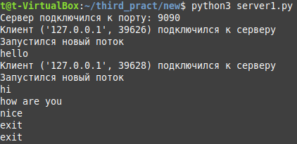
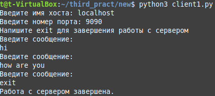
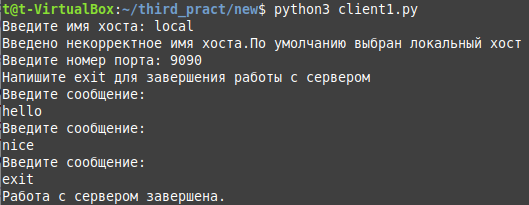
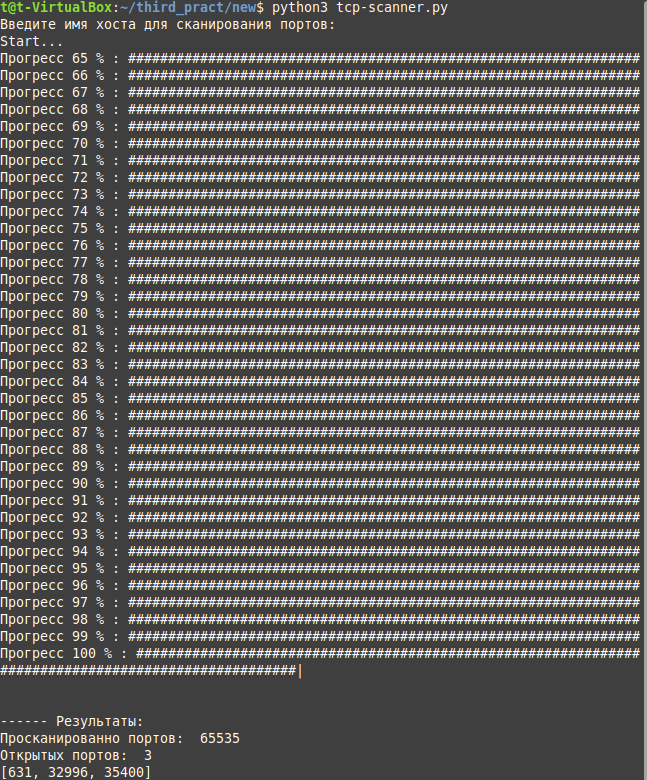

## Создание простого многопоточного сервера

### Основные задания
1. Создать простой эхо-сервер и клиент для него.
2. Модифицировать код сервера таким образом, чтобы при подключении нового клиента создавался новый поток и вся работа с клиентом выполнялась в нем.
3. Проверить возможность подключения нескольких клиентов к этому серверу одновременно. 

(files server1.py, client1.py)
 

Другой вариант решения: files server.py, client.py

### Дополнительные задания

Реализовать сканер TCP-портов. Программа должна запрашивать имя хоста/IP-адрес у пользователя. Затем программа должна пробовать подключиться к этому хосту ко всем портами по очереди. При успешном подключении программа должна выводить в консоль сообщение “Порт N открыт”. 
    1. Модифицировать эту программу, чтобы сканирование портов происходило параллельно. Для этого нужно распараллелить сканирование портов по нескольким потокам. 
    2. Обеспечить вывод списка открытых портов по порядку.
    3. Реализовать progress bar в командной строке, показывающий прогресс сканирования.

(file tcp-scanner.py)

