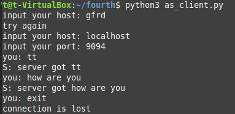
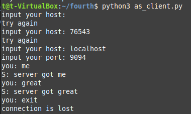

## Асинхронный сервер

Server:


Clients:




### Цель работы

Познакомиться с асинхронным выполнением процедур в Python при помощи asyncio

### Задания для выполнения

Реализуйте простейший эхо сервер используя модуль асинхронного программирования.

### Методические указания

В данной работы мы познакомимся с возможностями огранизации TCP-сервера при помощи asyncio в Python 3.6+

Данный модуль имеет определенные преимущества перед средствами организации многопоточности, а именно:
1. реализация кооперативной многозадачности;
1. простота написания кода и отладки выполнения программы;
1. простота обеспечения безопасности выполнения кода.

Модуль asyncio даже имеет некоторые встроенные средства для организации сервера и клиента. Как вы знаете, при написании асинхронных программ нельзя использовать стандартные блокирующие операции, такие как socket.recv(). Нужно либо оборачивать их в специальный обработчик, либо использовать особые, асинхронные версии таких операторов. К счастью, в модуле asyncio присутствует специальный синтаксис для организаци постоянно действующего сервера, инкапсулирующий всю служебную работу по организации потока событий.

Для начала, давайте напишем клиентскую часть, так как она гораздо проще. Нам нужно всю логику работы клиента, от открытия до закрытия соединения, выделить в функцию (асинхронную корутину):

``` python
async def tcp_echo_client(host, port):
    reader, writer = await asyncio.open_connection(host, port)
    message = 'Hello, world'

    writer.write(message.encode())
    await writer.drain()

    data = await reader.read(100)
    writer.close()
    await writer.wait_closed()
```

Обратите внимание на функцию asyncio.open_connection. Она возвращает два объекта, которые и используются для обмена сообщениями в асинхронном режиме. Для того, чтобы запустить эту функцию, нам нужно создать цикл событий, создать задачу и запустить задачу в цикле:

```python
loop = asyncio.get_event_loop()
task = loop.create_task(tcp_echo_client(HOST, PORT))
loop.run_until_complete(task)
```

Если вы используете Python 3.7, то вместо этой громоздкой конструкции можно написать просто:

```python
loop.run(tcp_echo_client(HOST, PORT))
```

Теперь приступим к созданию сервера. Для этого нам будет достаточно написать лишь функцию обработки подключения. Например, для эхо сервера она будет выглядеть примерно так:

```python
async def handle_echo(reader, writer):
    data = await reader.read(100)
    message = data.decode()

    writer.write(data)
    await writer.drain()

    writer.close()
```

Код запуска сервера мы тоже напишем в обособленной корутине, чтобы отделить его от остальной программы:

```python
async def main():
    server = await asyncio.start_server(handle_echo, HOST, PORT)
    await server.serve_forever()
```

Эту корутину можно запустить описанным выше способом, включив ее в список задач в цикле событий.
Однако, такой способ будет работать только в Python 3.7+. Если у вас версия 3.6, то организовать запуск следует немного иначе:

```python
loop = asyncio.get_event_loop()
coro = asyncio.start_server(handle_echo, '127.0.0.1', 8888, loop=loop)
server = loop.run_until_complete(coro)

try:
    loop.run_forever()
except KeyboardInterrupt:
    pass

server.close()
loop.run_until_complete(server.wait_closed())
loop.close()
```

Обратите внимание, что механизм использования асинхронных серверов существенно менятется от версии к версии. При написании промышленного кода необходимо унифицировать его для достижения универсальности выполнения.

### Дополнительные задания

Реализуйте все дополнительные задания из предыдущих методичек про многопоточный сервер, только с использованием модуля asyncio.
