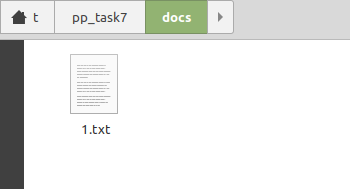

## FTP сервер

### Задания для выполнения

Создать сервер, который предоставляет клиенту базовые возможности файлового менеджера по сети. Клиент после подключения к серверу должен иметь возможности просматривать список файлов и папок в рабочей директории сервера (рабочая директория - это специальная папка, к которой имеет доступ процесс сервера, но она отделена от парки с кодом сервера и от любых системных файлов), создавать и удалять в ней папки, создавать, копировать и переименовывать файлы. Также клиент может передать на сервер название и содержимое файла и сервер должен создать соответствующий файл в текущей директории. Кроме того, клиент может запросить содержимое любого файла и сервер должен передать его в ответ.

1. Посмотреть содержимое папки;
2. Создать папку;
3. Удалить папку;
4. Удалить файл;
5. Переименовать файл;
6. Скопировать файл с клиента на сервер;
7. Скопировать файл с сервера на клиент;
8. Выход (отключение клиента от сервера);

docs - основная директория, содержащая изначальные файлы
ftp-server - файл сервера
ftp-client - файл клиента

запускаем сервер (python3 ftp-server.py), а затем клиента (python3 ftp-client.py), далее можем использовать комманды:

+ pwd - показывает название рабочей директории
+ ls - показывает содержимое текущей директории
+ exit - выход
+ createdir <dirname> - создает новую папку
+ deletefile <filename> - удаляет файл
+ deletedir <dirname> - удаляет папку
+ send <filename> - копирует файл с клиента на сервер
+ get <filename> - копирует файл с сервера на клиент

Комманды вводим в вкладке клиента.

Запущенный сервер:

Запущенный клиент:

После выполнения комманды deletefile файл 2 был удален

После выполнения комманды send файл 1 был скопирован из основной директории в папку, где располагается файл сервера 

