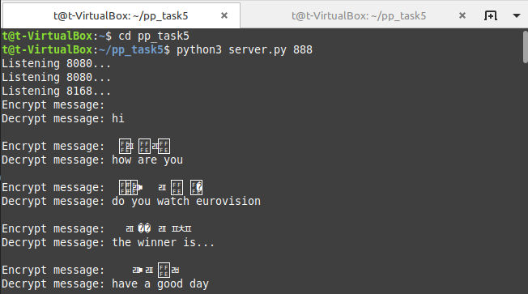
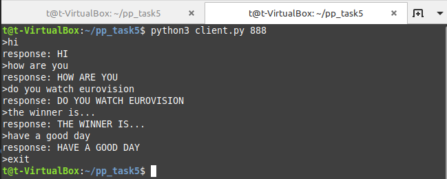
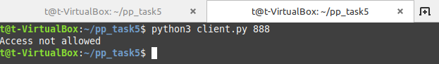

# Алгоритмы асимметричного шифрования
## Задания для выполнения
1. Реализовать протокол Диффи-Хеллмана в виде клиент-серверного приложения.
2. Реализовать клиент-серверную пару, которая шифрует сообщения асимметричным способом.

Основной алгоритм работы клиента и сервера такой:

1. При запуске клиент и сервер генерируют каждый свою пару ключей.
2. При подключении клиент посылает серверу свой открытый ключ.
3. В ответ, сервер посылает клиенту открытый ключ сервера.
4. Клиент посылает сообщение серверу, шифруя его своим закрытым ключом и открытым ключом сервера.
5. Сервер принимает сообщение, расшифровывает его сначала своим закрытым ключом, а потом - открытым ключом клиента.
6. Обратное сообщение посылается аналогично.

cipher - Класс для создания протокола Диффи-Хеллмана
server - Используется для создания ПУЛА портов и последующего общения с клиентами
client - Используется для создания нового порта для общения
ready_keys - готовые пары ключей
keys - текущие ключи

 

- при совпадении пары

 

- при несовпадении